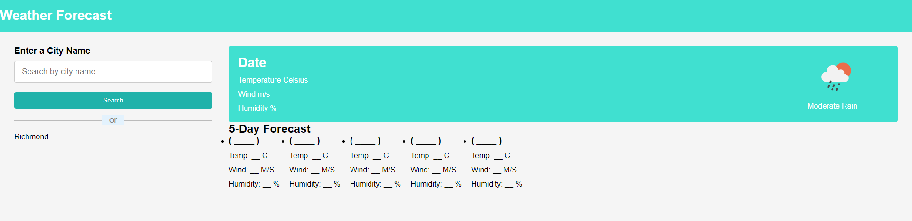

# Weather-App

##Description

This is a quiz application to test a user's knowledge of javascript. In this application, a user will click the play button ont he first screen to enter into a timed quiz. In that quiz, they will be given 5 questions to test their knowledge of javascript. There are a total of 5 questions and they have 60 seconds to complete the challenge. For any right answer, the option will turn green, else if wrong, the option will turn red. After the quiz is done, a user can save their score into local storage along with their intials.

To access, copy the repository in github, then use the git clone function in command line to clone this repository into your local machine.

##Usage

Link below:

https://devbelle.github.io/Weather-App/

##Credits

All commits and changes to this assignment were implemented by Devin Belle

##License N/A

##Features

Quiz includes a play button, followed by a sixty second timer to complete the quiz itself. Each question has 4 options and will show the user green if correct and red if incorrect. At the end of the quiz, the user's score will be saved into the local storage.

##Tests

Quiz will start after clicking play, each question option is clickable and responsive. End score is saved into local storage.
